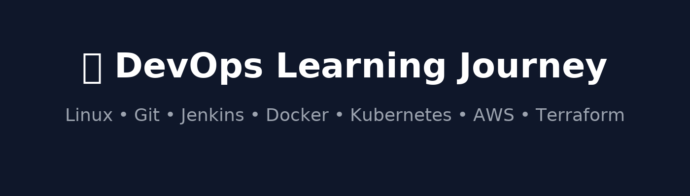

# 🚀 DevOps Learning Journey

Welcome to my DevOps learning journey!  
This repository is my **personal knowledge base** where I document everything I learn while transitioning into DevOps – from the **basics of Linux** to advanced concepts like **CI/CD, Containers, and Cloud**.

I believe in **learning in public**, so this repo is both my study space and a resource for anyone starting DevOps.

---

## 📂 Topics Covered

- 🐧 **Linux Basics** → Commands, scripting, server management
- 🌱 **Git & GitHub** → Version control, branching, collaboration
- 🔧 **Jenkins** → CI/CD pipelines, automation
- 📦 **Docker** → Containers, images, docker-compose
- ☸️ **Kubernetes** → Pods, deployments, scaling, configs
- ⚙️ **Ansible** → Configuration management, playbooks
- ☁️ **Cloud (AWS)** → EC2, S3, RDS, IAM, CloudWatch, VPC
- 🏗️ **Terraform** → Infrastructure as Code (IaC)

---

## 🛠️ Structure

Each **branch** of this repo represents one DevOps topic.

- [`linux`](https://github.com/Jashan-123/devops-notes/tree/linux) → Linux commands & scripting notes
- [`git-github`](https://github.com/Jashan-123/devops-notes/tree/git-github) → Git commands & workflows
- [`jenkins`](https://github.com/Jashan-123/devops-notes/tree/jenkins) → Jenkins pipelines & CI/CD notes
- [`docker`](https://github.com/Jashan-123/devops-notes/tree/docker) → Docker commands, Dockerfiles, projects
- [`kubernetes`](https://github.com/Jashan-123/devops-notes/tree/kubernetes) → K8s manifests & deployments
- [`ansible`](https://github.com/Jashan-123/devops-notes/tree/ansible) → Playbooks, roles, automation scripts
- [`terraform`](https://github.com/Jashan-123/devops-notes/tree/terraform) → IaC templates for AWS

---

## 📌 Projects

I’ll also be adding **mini-projects** as I learn:

- ✅ Linux command cheat sheets & scripts
- 🔄 CI/CD pipeline with Jenkins, Nexus & SonarQube
- 🐳 Multi-container app with Docker & Docker Compose
- ☸️ Deploying a sample app on Kubernetes
- ☁️ AWS projects (EC2 setup, S3, RDS, CodePipeline)
- ⚙️ Infrastructure automation with Terraform

---

## 📈 Progress Tracker

- [x] Linux Basics
- [ ] Git & GitHub
- [ ] Jenkins
- [ ] Docker
- [ ] Kubernetes
- [ ] Ansible
- [ ] AWS Cloud
- [ ] Terraform

---

## 🤝 Connect With Me

📌 I’m sharing my DevOps journey on [LinkedIn](https://www.linkedin.com/in/jashandeep-singh-118363191/) too!  
Let’s connect, collaborate, and grow together 🚀

---

⭐ If you’re also learning DevOps, feel free to **fork this repo** and use it for your own journey!
